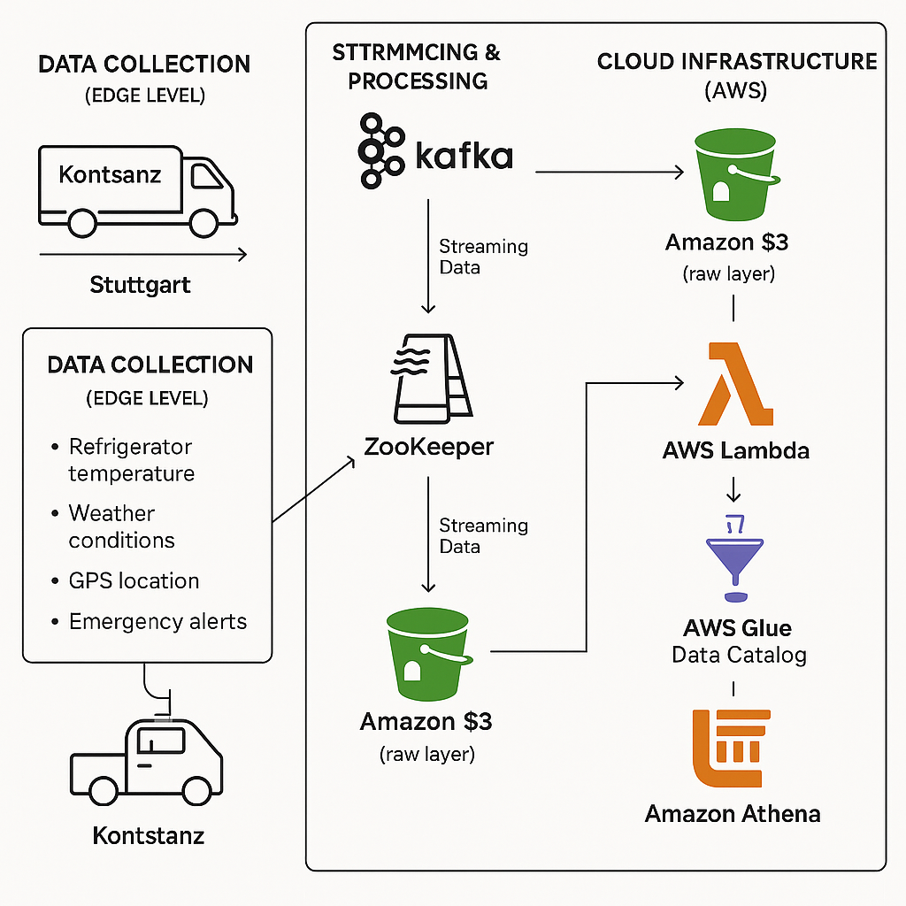

# 🚚 Real-Time Data Pipeline Using Kafka, Spark & AWS

### For a Logistics Company Operating Between Konstanz and Stuttgart, Germany

This project implements a **real-time data pipeline** using **Apache Kafka**, **Apache Spark**, and **AWS Cloud Services**. It simulates vehicle telemetry data (e.g., GPS coordinates, speed, timestamps) for a logistics company operating in Germany. The data flows through Kafka for ingestion, Spark for processing, and AWS for scalable storage, analytics, and visualization.

---

## 💻 Operating System

This project is developed and tested on:

* **Linux Ubuntu 24.04 LTS**

> ✅ All commands and installation steps are tailored for **Ubuntu 24.04** users.

---

## 🧽 Data Pipeline Architecture



**Flow Overview:**

1. **Vehicle Data Producer** (Python) simulates real-time telemetry
2. **Kafka** ingests and streams the data
3. **Spark Structured Streaming** processes the data
4. **AWS S3** stores raw and processed data
5. **AWS Redshift** performs advanced analytics
6. **AWS QuickSight** provides dashboards and visualizations

---

## 🔧 Technologies Used

* **Apache Kafka** – Real-time data streaming
* **Apache Spark** – Stream processing and analytics
* **AWS S3** – Cloud storage for ingested and processed data
* **AWS Redshift** – Scalable data warehousing
* **AWS QuickSight** – Data visualization and reporting
* **Docker** – Containerization of Kafka & Zookeeper
* **Python** – Data simulation and custom scripts

---

## 🛠️ Prerequisites

Ensure the following are installed and configured:

* [Docker](https://docs.docker.com/engine/install/ubuntu/)
* Docker Compose *(optional, for easier orchestration)*
* Apache Kafka CLI *(usually included with Kafka Docker images)*
* [AWS CLI](https://docs.aws.amazon.com/cli/latest/userguide/install-cliv2.html)
* Java (JDK 8 or above) – Required by Spark
* Python 3.x – For running the data simulation scripts

---

## 🐳 Step 1: Access Kafka Broker via Docker

Start your Kafka container, then run the following to interact with it:

```bash
# Access the Kafka broker container
docker exec -it kafka-broker bash

# List available topics
kafka-topics --bootstrap-server localhost:9092 --list

# Read from a specific topic (e.g., vehicle_data)
kafka-console-consumer --bootstrap-server localhost:9092 --topic vehicle_data --from-beginning
```

---

## 🗂️ Kafka Brokers Overview
## 🔧 How Kafka Works in This Project

### 1. Producers Send Data

We have multiple Kafka topics representing different data sources from vehicles:

- `vehicle_data` – General vehicle information (e.g., speed, fuel level)
- `gps_data` – Location coordinates from the vehicle
- `emergency_alerts` – Emergency signals like crash alerts or breakdowns
- `weather_data` – Weather conditions affecting the vehicle

These data streams are **produced** by devices or apps (producers) and sent to Kafka.

### 2. Kafka Broker Receives and Stores Data

Once the data is produced, it's sent to a **Kafka broker** (the Kafka server). The broker organizes this data:

- By **topic** (like `gps_data`, `vehicle_data`, etc.)
- And further splits each topic into **partitions**

> 📌 Partitions allow Kafka to scale and process messages in parallel while preserving the order of messages **within** a partition.

### 3. Consumers Read the Data

Kafka **consumers** then subscribe to these topics to read the data and perform various actions, such as:

- Logging to a database
- Triggering emergency responses
- Displaying real-time information on dashboards

---

## 🔄 Example Flow

1. A GPS device sends coordinates → `gps_data` topic.
2. Kafka stores the data in one of the topic’s partitions.
3. A consumer service reads the message and updates the vehicle's position on a map.

---
Below is a snapshot of the active Kafka brokers configured in the project:


---
## 🚀 Data streams in my vehicle_data topic will be like
```bash
kafka-console-consumer --bootstrap-server localhost:9092 --topic vehicle_data --from-beginning
```

## 🚀 Next Steps


---


---

## 🚀 Next Steps


---

## 📁 Repository Structure 

```bash
🔽 docker/
│   ├── kafka-compose.yml
🔽 data_simulator/
│   ├── producer.py
🔽 spark_jobs/
│   ├── spark_streaming.py
🔽 aws/
│   ├── s3_config/
│   └── redshift_setup.sql
🔽 README.md
```

---

## 🙌 Contributions & License

This project is open for contributions. Feel free to fork and improve.

Licensed under [MIT License](LICENSE).
